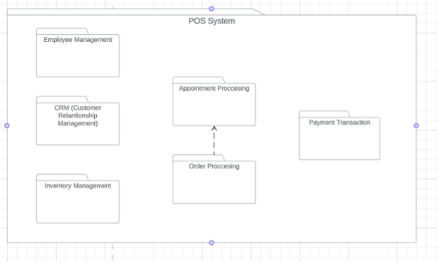

2 laboratory work

**VILNIAUS UNIVERSITETAS**

**MATEMATIKOS IR INFORMATIKOS FAKULTETAS**

**PROGRAMŲ SISTEMOS**

**3 KURSAS**

**Technical documentation for system implementation**

**PSPSPS team:**

Gustas Juškevičius

Gustas Logvinovas

Lukas Pupelis

Nojus Džiaugys

<!-- TOC -->
* [Context of Users](#context-of-users)
  * [Geography of Use](#geography-of-use)
  * [User Expectations](#user-expectations)
  * [Usage Patterns](#usage-patterns)
  * [System patterns](#system-patterns)
  * [Dependencies on External Systems](#dependencies-on-external-systems)

* [High level component breakdown](#high-level-component-breakdown)

* [Scalability of your system](#scalability-of-your-system)
  * [Services](#services)
  * [Architecture](#architecture)

* [Non-functional requirements](#non-functional-requirements)
  * [Performance](#performance)
  * [Scalability](#scalability)
  * [Capacity](#capacity)
  * [Availability](#availability)
  * [Reliability](#reliability)
  * [Serviceability](#serviceability)
  * [Recoverability](#recoverability)
  * [Security](#security)
  * [Compliance](#compliance)
  * [Environmental](#environmental)
  * [Usability](#usability)
  * [Portability](#portability)
  * [Compatibility](#compatibility-)

* [API](#api)

* [Full API contract in yaml file](#full-api-contract-in-yaml-file-)

* [API URL and HTTP verb](#api-url-and-http-verb-)
  * [Employee management](#employee-management)
    * [Employee account information](#employee-account-information)

  * [Inventory management](#inventory-management)
    * [What items are in stock/inventory](#what-items-are-in-stockinventory)
    * [**Products in inventory**](#products-in-inventory-)
    * [**Information on Item suppliers**](#information-on-item-suppliers)

  * [Customer Relationship Management](#customer-relationship-management)

  * [Appointment processing](#appointment-processing)
    * [Appointment information](#appointment-information)

  * [Order processing](#order-processing)
    * [Which Items are in which orders](#which-items-are-in-which-orders)
    * [Orders and details on them](#orders-and-details-on-them)

  * [Payment Transactions](#payment-transactions)
    * [Payment information](#payment-information)

  * [Parameters and Responses](#parameters-and-responses)
    * [Parameters](#parameters)
    * [Responses](#responses)
    * [Error Handling](#error-handling)
<!-- TOC -->

# Context of Users

## Geography of Use

Countries -- The Baltics (Lithuania, Latvia, Estonia).

## User Expectations

Expected average daily user count - ~ 30000. (Max users: ~ 95824,
if every establishment uses it at once).

This number is calculated based on the number of restaurants, cafes,
and hotels there are in each country[^1].

As of 2023, there are:

-   3,659 Restaurants & Takeaway Food Operators in Lithuania.

-   2,971 Restaurants & Takeaway Food Operators in Latvia.

-   2,369 Restaurants & Takeaway Food Operators in Estonia.

-   300 Hotels in Lithuania.

-   385 Hotels in Latvia.

-   308 Hotels in Estonia.

On average:

-   Restaurants in the Baltics have 8 employees.

-   Hotels in the Baltics have 24 employees.

In our case, not every company, especially large ones, will use our
POS system. So at least 2/3 of the restaurants and hotels can be
ignored.

## Usage Patterns

Customer patterns differ based on the business, so we will calculate
the average:

1)  Restaurants:

-   Working hours: ~ from 10 am to 10 pm.

-   Daily peaks: Lunchtime (12-13:30) and Dinnertime (18-20)

-   Weekly peaks: Weekends (Friday - Sunday)

-   Monthly peaks: The start or the end of the month, based on when
    people get their salary.

-   Yearly peaks: All holiday or local events.

2)  Cafés:

-   Working hours: ~ from 8 am to 9 pm.

-   Daily peaks: Morning rush (8-10) and Afternoon break (14-16)

-   Weekly peaks: Weekends (Friday - Sunday)

-   Monthly peaks: The start or the end of the month, based on when
    people get their salary.

-   Yearly peaks: All holiday or local events and during spring or
    summer (due to the ability of sitting outside).

3)  Hotels:

-   Working hours: 24/7.

-   Daily peaks: Check-in (15-16) and Check-out (11-12)

-   Weekly peaks: Weekends

-   Monthly peaks: -

-   Yearly peaks: Holiday seasons and local events (festivals)

## System patterns

1.  The POS system is designed with the following read/write ratio:

-   Read Operations: 75%

-   Write Operations: 25%

These percentages indicate that a significant portion of system
operations involve reading data, particularly for reporting purposes.
Write operations, such as recording transactions, constitute a smaller
percentage of overall system activity.

2.  The POS system is designed with the following usage patterns:

-   Desktop Usage: 70%

-   Mobile Usage: 30%

Most of the operations are anticipated to be performed on desktop
computers, especially for back-office tasks, while mobile devices are
essential for on-the-floor transactions by cashiers in Baltic retail
stores.

## Dependencies on External Systems

The POS system is integrated with local payment processors and financial
institutions to facilitate transactions in accordance with the country's
currency and banking standards.

# High level component breakdown

**Inventory Management**: Inventory-related packets are sent to update
the stock levels in real-time. These packets convey information about
the items sold, returned, or added to the inventory. This helps in
maintaining accurate stock levels across the entire system.

**Customer Relationship Management (CRM)**: CRM packets include customer
information, preferences, and purchase history. These packets facilitate
personalized customer interactions and promotions. They are transmitted
between the POS system and a central CRM database.

**Employee Management**: When employees log in or perform specific
actions, authentication packets are sent to verify their access
permissions. This helps in maintaining security and tracking employee
activities.

**Order Processing:** Order-related packets are crucial for updating the
system with information about new orders, order modifications, and
cancellations. These packets ensure seamless communication between the
point of sale (POS) system and the inventory management system, helping
to track product availability and fulfillment status.

**Appointment Processing:** Appointment-related packets are utilized to
schedule, modify, or cancel appointments within the system. These
packets contain details such as appointment time, customer information,
and any specific requirements. This facilitates efficient appointment
management and coordination between different components of the system.

**Payment Transaction**: When a customer makes a payment, the POS system
generates payment authorization packets. These packets are transmitted
to the payment gateway for processing and approval. Once approved, a
confirmation packet is sent back to the POS system.

# Scalability of your system

We expect our business clients who use our POS (Point of Sale) to grow
their customer base and expand internationally as a result. Because of
that it is important to consider our architecture to avoid a lot of
problems further down the line.

To make our program scalable we have our system divided into multiple
different microservices responsible for a certain part of the system,
which act independently and only communicate to exchange data. This
makes developing and deploying each service independent and overall
process very flexible and easy to maintain.

## Services

1)  Order Management Service:

    -   Responsible for handling customer orders.

    -   Manages order placement, modification, and cancellation.

    -   Tracks order status and communicates with other services for
        order fulfillment.

2)  Payment Service:

    -   Deals with payment processing, including transactions,
        discounts, and loyalty rewards redemption.

    -   Ensures secure and efficient payment transactions.

3)  Customer Service:

    -   Manages customer-related functionalities such as loyalty
        rewards, feedback collection, and their order history.

    -   Facilitates communication between customers and the rest of the
        system.

4)  User Interface Service:

    -   Provides a user interface for customers to interact with the
        system.

    -   Handles order placement, feedback submission, and loyalty reward
        redemption interfaces.

5)  Staff Management Service:

    -   Manages information related to waitstaff, kitchen personnel,
        beauticians, and cashiers.

6)  Inventory Management Service:

    -   Handles inventory-related tasks, including tracking product
        availability, managing stock levels, and interacting with
        suppliers.

7)  Admin Management Service:

    -   Supports higher-level users such as managers and administrators.

    -   Manages menu configurations, employee access control, and
        performance analysis.

8)  Supplier Service:

    -   Provides functionalities for suppliers to manage inventory and
        order fulfillment efficiently.

    -   Ensures that products or ingredients are available as needed.

## Architecture

To further stick to our scalability agenda, we chose event-driven
architecture, where microservices communicate through events. Making
each microservice responsible for only pushing an event when it sends
or requests information and of course listening to other events. This
further makes us a lot more flexible with better fault tolerance and
complete independence.

For Database, to continue with our isolation we chose decentralized
data management, meaning that every microservice will have its own
database. This makes not only the logic side of the microservice
independent, but also the data side, making specific parts of our
system completely independent and we can scale them at different
paces.

About deployment:

-   Deploy each microservice as an independent unit.

-   Implement load balancing to distribute incoming requests among
    multiple instances of a microservice. This ensures high
    availability.

# Non-functional requirements

## Performance

The system must process transactions with a response time of less than 2 seconds.

## Scalability

-   The POS system must easily scale to support an additional 20%
    increase in concurrent users within a one-year period. *(1.2 User
    Expectations)*

-   The system should be able to scale horizontally to handle a 30%
    increase in transaction volume during peak hours within the next six
    months. *(1.2 User Expectations)*

-   Vertical scaling should be supported to accommodate a growth of up
    to 50% in transaction volume over the next two years.

-   The system should be able to scale to handle a 50% increase in the
    number of products tracked in the inventory over the next year.

-   Inventory management should remain efficient as the business
    expands, supporting multiple locations if necessary.

-   The database architecture should scale horizontally to accommodate a
    50% increase in data storage requirements over the next two years.

-   The system should handle a 40% increase in electronic payment
    transactions per hour over the next year. *(1.4 System Patterns)*

-   The system should easily integrate with new printing and peripheral
    devices as the business expands.

-   The customer database should scale to accommodate a 100% increase in
    entries over the next year.

## Capacity

-   It must support a minimum of 100 transactions per minute during peak
    hours. Peak hours in this context usually mean lunch time (approx.
    12:00-14:00), dinner time (18:00-20:00) and hours after work until
    midnight (17:00-24:00), hotel Check-out (11:00-12:00), Check-in
    (15:00-16:00). *(1.3 Usage Patterns)*

-   The system must support a daily user count of 30000, meaning at
    minimum 1250 users per hour at peak hours. *(1.3 Usage Patterns)*

-   The system must support a minimum of 10 concurrent users per
    terminal. *(1.3 Usage Patterns)*

-   The system must support a minimum of 1000 unique products or menu
    items.

-   Inventory updates must be real-time, and low-stock alerts should be
    triggered as defined thresholds are reached.

-   The system database should have the capacity to store transaction
    records for at least one year.

## Availability

-   The system's database must have a backup to ensure fast data
    recovery and renewal of the service.

-   The system must be maintained at least once a week during the early
    morning hours (03:00-05:00) and must be put online in less than a
    minute after maintenance. *(1.3 Usage Patterns)*

-   Load balancing mechanisms should be implemented to distribute
    incoming transactions and requests evenly across servers.

-   The POS system should operate smoothly with redundant network
    connections to prevent disruptions caused by network failures.

-   The POS system should ensure availability across different
    geographic locations (Lithuania, Latvia, Estonia) to support
    businesses with multiple branches or franchises.

-   The POS system should be available 24/7. *(1.3 Usage Patterns)*

-   Geographic redundancy and failover mechanisms should be in place to
    address regional outages. *(1.1 Geography of use)*

-   In the event of a network or system failure, the POS system should
    provide emergency access mechanisms, such as offline mode, to enable
    basic transaction processing.

## Reliability

-   The system must have a minimum uptime of 99%. Must be up from 05:00
    -- 3:00 EET time. *(1.3 Usage Patterns)*

-   In the event of a system failure, data recovery should be possible
    within 30 minutes.

-   Critical data, such as transaction records and customer information,
    should be replicated across geographically distributed servers for
    data redundancy. *(1.1 Geography of Use)*

-   Error messages presented to users should be informative, avoiding
    technical jargon, and guiding users on appropriate actions.

-   All transactions, including sales, refunds, and voids, should be
    processed with complete (100%) accuracy.

-   The POS system should maintain consistent and up-to-date data across
    all components, including product information, prices, and inventory
    levels.

-   The POS system should provide real-time notifications for critical
    events, such as system errors, low inventory, or unusual transaction
    patterns.

-   The system should employ failover mechanisms to switch to backup
    components in the event of a hardware or software failure.

-   Proactive alerts should be generated for system administrators to
    investigate and address potential reliability issues.

## Serviceability

-   The POS system should support remote maintenance and diagnostics,
    allowing system administrators to troubleshoot and resolve issues
    without being physically present at the terminal.

-   Comprehensive logging mechanisms should be in place to capture
    system events, errors, and user activities.

-   The system architecture should be modular, allowing for the easy
    replacement or upgrade of individual components without affecting
    the entire system.

-   Changes to configurations should be logged, and rollback options
    should be available.

-   The system should include mechanisms for users to provide feedback
    on issues they encounter or suggest improvements.

## Recoverability

-   The system should support automatic and regular backups of critical
    data, including transaction records, customer information, and
    configuration settings.

-   The POS system should support point-in-time recovery, allowing
    administrators to restore the system to a specific state before data
    corruption or system failure occurs.

-   In the event of a transaction failure or error, the system should
    support the rollback of incomplete transactions to maintain data
    consistency.

-   The database system should support rollback mechanisms to revert to
    a previous state in the event of a critical error or data
    corruption.

-   Recovery procedures, including backup restoration and disaster
    recovery processes, should be thoroughly tested every quarter.

-   The system should support high availability configurations, such as
    active-active or active-passive setups, to minimize downtime during
    failures.

## Security

-   Passwords must be hashed and salted.

-   All users must be authenticated.

-   All transactions must be encrypted.

-   Access logs and audit trails must be maintained to track user
    activities for security and compliance purposes.

## Compliance

-   System must comply with relevant data protection regulations, such
    as GDPR. [1.5 Dependencies on external systems](#Dependencies-on-external-systems)

## Environmental

System must work at room temperature, indoors. Workers of restaurants
and beauty salons must be able to use this system without special
training.

## Usability

-   The system must support touchscreen interactions for quick and easy
    order entry. [System Patterns](#system-patterns)

## Portability

-   The POS system must be compatible with various hardware devices
    commonly used in the food and beauty service industry.

-   It must support multiple operating systems, including Windows,
    macOS, and Linux.

## Compatibility 

POS system must be compatible with various printers, scanners, and
other peripherals used in the food and beauty service sectors.

# API

# Full API contract in yaml file 

[Contract.yaml](../contract.yaml)

# API URL and HTTP verb 

## Employee management

### Employee account information

- __`GET`__ `/api/StaffUsers`
  
  Retrieves a list of StaffUsers.
  Supports pagination and filtering through query parameters.

- `POST /api/StaffUsers`

  Creates a new StaffUser.
  The request body needs to include details.

- `GET /api/StaffUsers/{id}`

  Retrieves the details of a specific StaffUser identified by `id`.

- `PUT /api/StaffUsers/{id}`

  Updates an existing StaffUser identified by {id}. The request body needs include updated details.

- `DELETE /api/StaffUsers/{id}`

  Deletes a StaffUser identified by {id}. Used to remove the StaffUser from the system.

## Inventory management

### What items are in stock/inventory

-   **GET** /api/Inventory

Retrieves a list of Inventory items. Supports pagination and filtering
using query parameters.

-   **POST** /api/Inventory

Creates a new Inventory item. The request body needs to include details.

-   **GET** /api/Inventory/{id}

Retrieves the details of a specific Inventory item identified {id}.

-   **PUT** /api/Inventory/{id}

Updates an existing Inventory item identified {id}. The request body
needs to include updated details.

-   **DELETE** /api/Inventory/{id}

Deletes an Inventory item identified by {id}. Used to remove Inventory
items from the system.

### **Products in inventory** 

-   **GET** /api/Products

Retrieves a list of Products. Supports pagination and filtering through
query parameters.

-   **POST** /api/Products

Creates a new Product. The request body needs to include details.

-   **GET** /api/Products/{id}

Retrieves the details of a specific Product identified by {id}.

-   **PUT** /api/Products/{id}

Updates an existing Product identified by {id}. The request body should
include updated details.

-   **DELETE** /api/Products/{id}

Deletes a Product identified by {id}. Used to remove the Product from
the system.

### **Information on Item suppliers**

-   **GET** /api/Suppliers

Retrieves a list of Suppliers. Supports pagination and filtering through
query parameters.

-   **POST** /api/Suppliers

Creates a new Supplier. The request body needs to include details.

-   **GET** /api/Suppliers/{id}

Retrieves the details of a specific Supplier identified by {id}.

-   **PUT** /api/Suppliers/{id}

Updates an existing Supplier identified by {id}. The request body should
include updated details.

-   **DELETE** /api/Suppliers/{id}

Deletes a Supplier identified by {id}. Used to remove the Supplier from
the system.

## Customer Relationship Management

Everything about customers

- `GET /api/Customers`

  Retrieves a list of Customers. Supports pagination and filtering through query parameters.

- `POST /api/Customers`

  Creates a new Customer. The request body needs to include details.

- `GET /api/Customers/{id}`

  Retrieves the details of a specific Customer identified by {id}.

- `PUT /api/Customers/{id}`

  Updates an existing Customer identified by {id}. The request body should include updated details.

- `DELETE /api/Customers/{id}`

  Deletes a Customer identified by the {id}. Used to remove the Customer from the system.

## Appointment processing

### Appointment information

-   **GET** /api/Appointment

Retrieves a list of appointments. Supports pagination and filtering
through query parameters.

-   **POST** /api/Appointment

Creates a new appointment. The request body needs to include details.

-   **GET** /api/Appointment/{id}

Retrieves the details of a specific appointment identified by {id}. This
endpoint is used to get the full details of a single appointment.

-   **PUT** /api/Appointment/{id}

Updates an existing appointment identified by {id}. The request body
needs to include the appointment details that need to be updated.

-   **DELETE** /api/Appointment/{id}

Deletes an appointment identified by {id}. This endpoint is used to
remove an appointment from the system.

## Order processing

### Which Items are in which orders

-   **GET** /api/OrderItems

Retrieves a list of OrderItems. Supports pagination and filtering
through query parameters.

-   **POST** /api/OrderItems

Creates a new OrderItem. The request body needs to include details.

-   **GET** /api/OrderItems/{orderId}/{productId}

Retrieves the details of a specific order item identified by {orderId}
and {productid}.

-   **PUT** /api/OrderItems/{orderId}/{productId}

Updates an existing order item identified by {orderId} and {productId}
path parameters. The request body should include updated details.

-   **DELETE** /api/OrderItems/{orderId}/{productId}

Deletes an order item identified by {orderId} and {productId} path
parameters. Used to remove the OrderItems from the system.

### Orders and details on them

- GET /api/Orders

  Retrieves a list of Orders. Supports pagination and filtering using query parameters. Includes an optional fullInfo parameter that, when set to true, provides all the detailed order information. Otherwise, some fields are null by default.

- GET /api/Orders/{id}

  Retrieves the details of a specific Order identified by {id}. Includes an optional fullInfo parameter that, when set to true, provides all the detailed product information. Otherwise, some fields are null by default.

- POST /api/Orders

  Creates a new Order. The request body needs to include details. Includes an optional fullInfo parameter that, when set to true, lets API know, that fields, which are usually null, will be populated.

- PUT /api/Orders/{id}

  Updates an existing Order identified by {id}. The request body needs to include details. Includes an optional fullInfo parameter that, when set to true, let the API know, that fields, which are usually null, will be populated.

- DELETE /api/Orders/{id}

  Deletes an Order identified by {id}. Used to remove the order from the system.

## Payment Transactions

### Payment information

-   **GET** /api/Transactions

Retrieves a list of Transactions. Supports pagination and filtering
through query parameters.

-   **POST** /api/Transactions

Creates a new Transaction. The request body needs to include details.

-   **GET** /api/Transactions/{id}

Retrieves the details of a specific Transaction identified by {id}.

-   **PUT** /api/Transactions/{id}

Updates an existing Transaction identified by {id}. The request body
should include updated details.

-   **DELETE** /api/Transactions/{id}

Deletes a Transaction identified by {id}. Used to remove the Transaction
from the system.

## Parameters and Responses

### Parameters

Some parameters are common through the endpoints, some are unique.

-   Common Parameters:

    -   id: used for querying specific records from the API.

    -   page: the page number of the results to be returned.

    -   pageSize: the number of records per page.

**Note on page and pageSize:** when asking for page=3&pageSize=3, the
API use this formula $(page - 1)*pageSize$ to skip items, so in this
specific case, it will skip 6 items and then return the next 3.

-   Unique parameters:

    -   fullInfo: used in the Order endpoint to get data that is null by
        default.

### Responses

Although there are differences, generally, responses follow these
structures:

-   GET Requests for lists (e.g., /api/Appointments, /api/Orders):

Returns an object with two elements: Data that includes all requested
items, and nextPage containing link to the next page in pagination.
nextPage should be blank if there is no next page.

-   GET Requests for unique records (e.g., /api/Appointments{id}, etc):

Return and object by that identifier. (Order Items don't have an id).

-   POST Requests (e.g., /api/Appointments, etc.):

Response contains the new entity.

-   PUT Requests (e.g., /api/Appointment/{id}, etc.):

Response contains the updated entity.

-   DELETE Requests (e.g., /api/Appointment/{id}, /api/Orders/{id}):

Response is NoContent.

### Error Handling

The API uses standard HTTP response status codes to indicate the
success/failure of API requests.

Status codes:

-   200 OK: Request succeeded.

-   201 Created: Resource created successfully (POST).

-   400 Bad Request: The request was invalid.

-   404 Not Found: The requested resource was not found.

-   500 Internal Server Error: A generic error occurred on the server.

Responses to error conditions may or may not include a message
explaining the error.

[^1]: Data is taken from an industry reports website IBISWorld.
